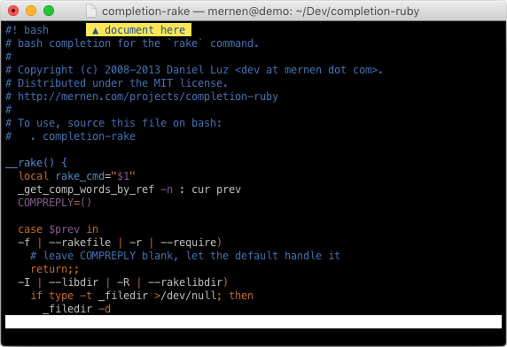

terminaldocument
================

This is a [Vim] plugin that shows a proxy icon on the title bar for the file
you're editing when running on Terminal.app on OS X El Capitan.

## Installation

### With pathogen.vim

If you have [pathogen.vim], the easiest way to install is to clone this
repository into `~/.vim/bundle`.

### Manual

The simplest way without depending on other plugins is to copy
[terminaldocument.vim] (./plugin/terminaldocument.vim) (just this file) into
the `~/.vim/plugin` directory.

## License

This code is free to use under the terms of the MIT license.
See the [LICENSE](./LICENSE) file for details.

[pathogen.vim]: https://github.com/tpope/vim-pathogen
[Vim]: http://www.vim.org
